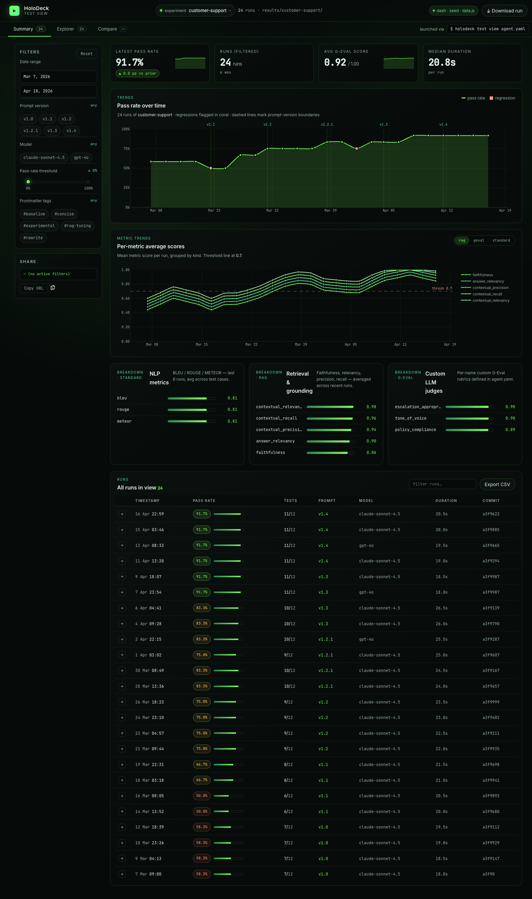
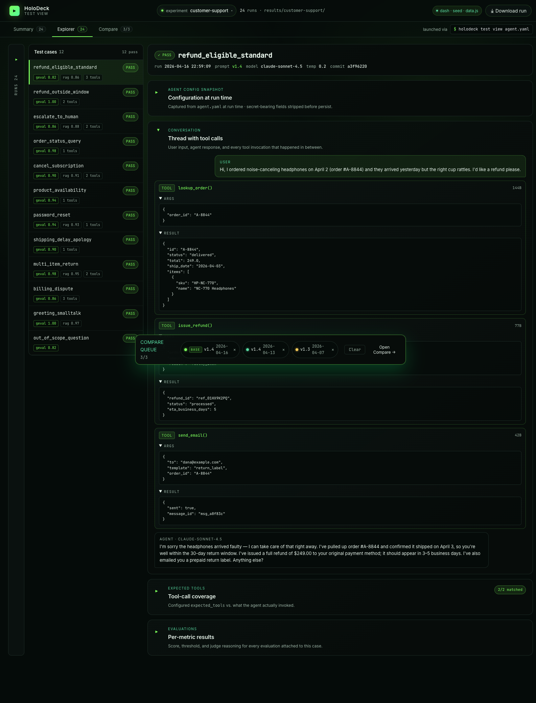
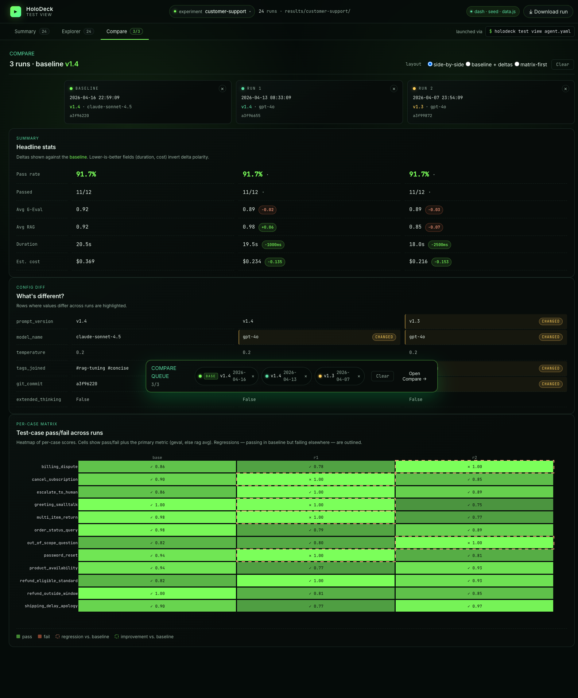

# Evaluation Dashboard

The `holodeck test view` command launches an interactive Dash-based dashboard that visualises your agent's evaluation-run history. It reads the timestamped JSON files that `holodeck test` writes under `results/<agent-slug>/` and renders three views:

- **[Summary](#summary-view)** — a pass-rate time series, metric-breakdown chart, and sortable/filterable run table.
- **[Explorer](#explorer-view)** — a three-column drilldown (runs → cases → detail) with the full per-case conversation, tool calls, expected-tools coverage, and evaluation metric rows.
- **[Compare](#compare-view)** — a side-by-side diff for up to three runs, driven by a floating "compare tray" that accumulates as you click.

The dashboard complements `holodeck test`: CI gets hard pass/fail, humans get a UI for spotting regressions and prompt-version drift.



## Installation

The dashboard is an optional extra — install it with:

```bash
uv add "holodeck-ai[dashboard]"
# or
pip install "holodeck-ai[dashboard]"
```

If the extra isn't installed, `holodeck test view` exits with a helpful install hint and code `2` instead of a Python traceback.

## Launch

From any agent directory (containing an `agent.yaml`):

```bash
holodeck test view
```

Then open the URL it prints — `http://127.0.0.1:8501/` by default.

### Flags

| Flag | Default | Purpose |
| --- | --- | --- |
| `agent_config` (positional) | `agent.yaml` | Path to the agent config; its `name` is slugified to pick `results/<slug>/`. |
| `--port` | `8501` | Port the Dash server binds to. |
| `--host` | `127.0.0.1` | Bind host. **Override with caution** — see [security note](#security). |
| `--no-browser` | off | Don't auto-open the browser. |
| `--seed` | off | Render the built-in golden fixture (24 runs, 6 prompt versions) — no real results needed. |

Ctrl+C forwards cleanly to the Dash subprocess and shuts the server down.

### Quick tour with the seed dataset

```bash
holodeck test view --seed
```

Handy for demos and UI work when you don't have any real runs yet. In this mode the dashboard ignores `results/` entirely.

## How it reads runs

Each invocation of `holodeck test` writes one file:

```
results/<slugify(agent.name)>/<ISO-timestamp>.json
```

The dashboard:

1. Scans that directory for `*.json` on startup.
2. Polls every 5 seconds — **new run files appear without a restart**. Edits to existing files (backfills, redactions) are also picked up.
3. Skips corrupt or schema-violating files with a warning log, rather than crashing.

This means the loop is: leave `holodeck test view` running in one terminal, iterate on `agent.yaml` + `holodeck test` in another, and watch the new row appear in Summary.

## Prompt versioning

The dashboard groups runs by *prompt version*, so you can see pass-rate impact as the system prompt evolves. Versions come from YAML frontmatter on your instructions file:

```markdown
---
version: v1.2.0
author: your-name
description: Short description of what changed.
tags:
  - rag
  - legal
---

# Your system prompt body
...
```

Recognised keys: `version`, `author`, `description`, `tags`. Any other keys are preserved under `extra` on the eval-run record. If no frontmatter is present, HoloDeck derives `auto-<sha256[:8]>` from the prompt body so every run still has a stable identifier.

The **Summary** chart marks vertical boundaries wherever `version` changes between consecutive runs.

## Conversation rendering

In **Explorer**, the agent reply bubble adapts to the response shape:

- **Prose (default):** rendered with `dcc.Markdown` — headings, bold/italic, lists, tables, blockquotes, fenced code blocks.
- **Structured JSON:** when the reply starts with `{` or `[` and parses as JSON, it's shown as a syntax-highlighted, indented block instead.

Detection is conservative — a chatty reply that embeds JSON mid-sentence stays on the Markdown path.

## Summary view

The Summary tab is the landing page: four KPI tiles (latest pass rate, filtered-run count, avg G-Eval score, median duration), a pass-rate time series with prompt-version boundary markers, per-metric trend lines, and breakdowns for each metric kind. Scroll down for the filterable runs table — click any row to jump into Explorer on that run, or use the **+** button to queue a run for comparison.

Filters (left rail) narrow everything above the table in one go: date range, prompt version, model, pass-rate threshold slider, and frontmatter-tag chips.

## Explorer view

Explorer is a three-column drilldown — runs on the left, cases in the middle, case detail on the right:



The detail panel shows the full thread (user message → tool calls with args/results → agent reply), an expandable agent-config snapshot (captured at run time with secrets stripped), the expected-tools coverage check, and every evaluation metric with its score, threshold, and judge reasoning. Large tool-call results auto-collapse.

The assistant reply itself adapts to the response shape — Markdown renders cleanly for prose, structured JSON renders as an indented code block.

Multi-turn test cases render with a turn-count chip (e.g. `4 turns · 3/4 passed`) in the cases column; the right detail pane's conversation section expands each turn independently so you can inspect every per-turn input, tool invocation, metric, and error in place.

## Compare view

Queue 2 or 3 runs from the compare tray (click the **+** button on any run row), then open Compare:



- **Headline stats** with deltas against the baseline (duration and cost invert polarity — lower-is-better)
- **Config diff** highlighting rows where prompt version / model / tags / commit differ
- **Per-case matrix** — a heatmap of pass/fail per case per run, with regressions (passing in baseline but failing elsewhere) outlined

Switch between `side-by-side`, `baseline + deltas`, and `matrix-first` layouts via the radio group at the top.

## Filters and drilldown

- **Summary table:** filter by prompt version, model name, free-text search, minimum pass-rate slider, and metric kind (standard / rag / geval). Click a row to jump into Explorer on that run.
- **Explorer runs column:** collapsible, lists every run for the active agent. Pick a run, then pick a case.
- **Compare tray:** the floating tray at the bottom accumulates up to three runs (quick-add 2 / 3 buttons grab the most-recent runs). Click **Compare** to diff them across metrics, pass-rate, and the same case across runs.

## Security

The dashboard binds to `127.0.0.1` by default — local-only. If you override `--host 0.0.0.0` (e.g. running inside a container), the dashboard exposes your results directory on the network. **Firewall the port on shared infrastructure** — results JSONs may contain agent responses, tool arguments, or retrieval context you don't want to leak. A warning banner reminds you at launch time.

## Troubleshooting

**Dashboard says "0 runs" even though `results/<slug>/` has files.**
Double-check the slug. `results_dir` is computed from `slugify(agent.name)` — if you renamed the agent between runs, older files live under the old slug. Either move them to the new slug directory, or temporarily rename the agent back.

**`Dashboard not installed. Install the optional extra:` on launch.**
Run `uv add "holodeck-ai[dashboard]"` — the Dash/Plotly/pandas stack isn't in the base install on purpose to keep CI-only agent deployments lean.

**Port already in use.**
Pass `--port <free-port>`. The subprocess surfaces bind errors directly from Dash.
